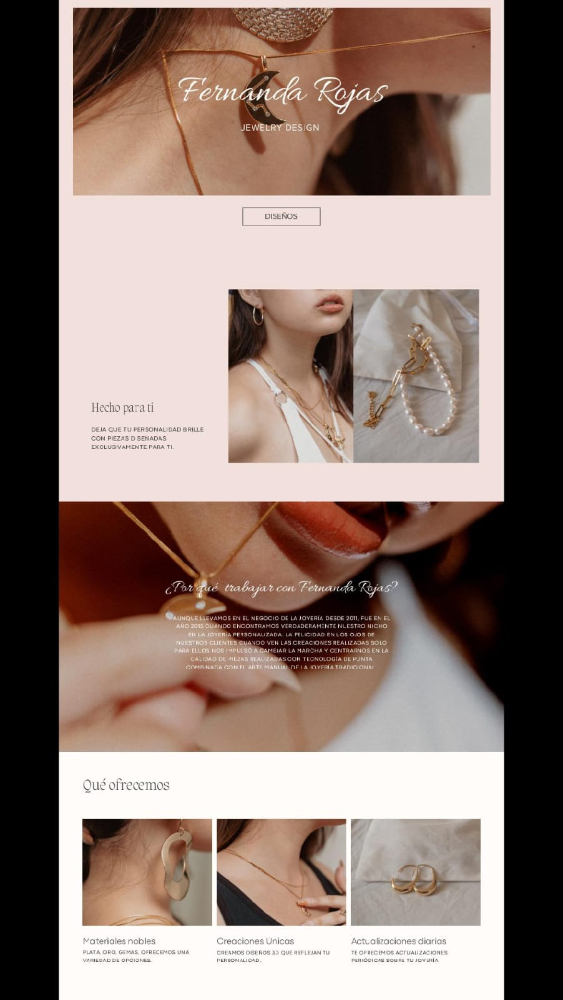

# BIT-1 - Sitio web de Joyeria

## Descripcion

Este es un sitio web responsive, diseñado para la demostracion de algunas joyas de lujo, con el fin de que el cliente se contacte con nosotros para empezar a trabajar juentos.

---
## 👤 Autor

Samuel Restrepo Mendez

## Wirframe 

## Aplicacion de Tecnologias

-HTMl
-CSS (Archivo externo)
-Bootstrap 5
-JavaScript (Archivo externo)
- Git y GitHab (Control de versiones)

## Funcionalidades 

1. Responsive desde 575px hasta 1320px
2. Apartado de Diseño (Con galeria de imagenes) 
3. Apartado de Contacto (Que muestra los datos ingresados por pantalla)
4. Navegacion en archivos externos 

## GitHab Pages

- 🔗 GitHub Pages:(https://samuel-restrepo223.github.io/git-1/)
